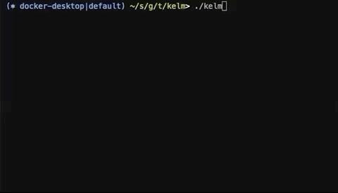

# Kelm

[](https://goreportcard.com/report/github.com/takaishi/kelm)
[][license]

[license]: https://github.com/takaishi/kelm/blob/master/LICENSE

Interactive kubernetes operator like a peco and Emacs helm.



## Install

```
$ brew tap takaishi/homebrew-fomulas
$ brew install kelm
```

## Usage

```
$ kelm
```

##  Custom Action

You can write custom action to `~/.kelm`.

For example:

```yaml
---
actions:
  pods:
    - name: "log"
      command:  "kubectl -n {{ .Namespace }} log {{ .Obj.metadata.name }}"
  nodes:
    - name: "ssh"
      variables:
        - name: address
          jsonpath: '{.status.addresses[?(@.type=="InternalIP")].address}'
      command: 'ssh {{ .address }}'

```

## Author

[r_takaishi](https://github.com/takaishi)